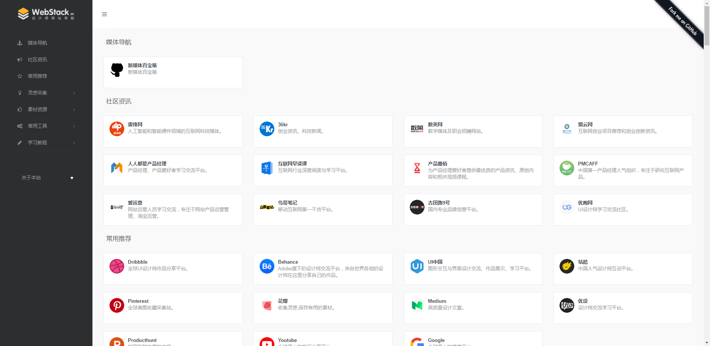
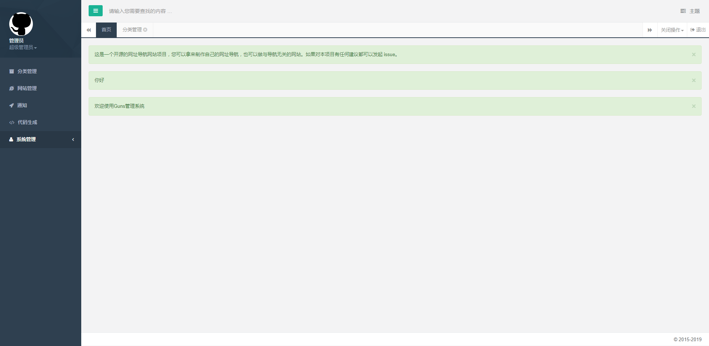
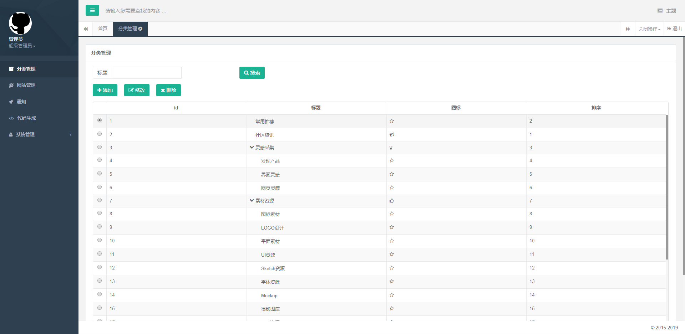
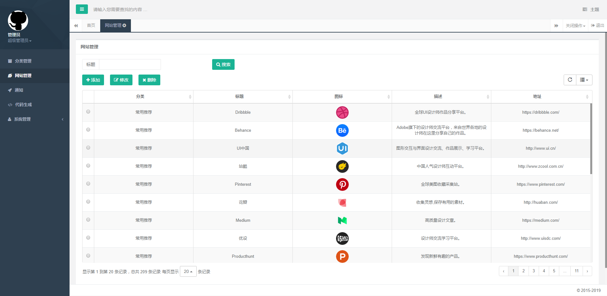

# WebStack-Guns

一个开源的网址导航网站项目，具备完整的前后台，您可以拿来制作自己的网址导航。




## 运行

克隆代码：

```shell
git clone https://github.com/jsnjfz/WebStack-Guns.git
```

导入IDE，建议用IDEA打开项目目录，待maven下载完jar包


编辑配置：

```
application.yml
```
```
上传文件路径，注意windows环境和linux环境：
file-upload-path
如需显示初始网站图标请把Webstack-Guns/src/main/webapp/static/tmp下的图片复制到上传文件路径
```

```
...
数据库连接，用户名密码：
url
username
password
...
```

新建数据库(utf8mb4)，导入数据：

```shell
guns.sql
```

maven打包或者IDE启动服务：

```shell
$ java -jar Webstack-Guns-1.0.jar
```

启动完成：http://127.0.0.1:8000


## 使用

后台地址：http://domain/admin

默认用户：admin

默认密码：111111

在线demo: http://117.78.18.7:8000/








## 感谢

前端设计：[**WebStackPage**](https://github.com/WebStackPage/WebStackPage.github.io)

后台框架：[**Guns**](https://github.com/stylefeng/Guns)

&nbsp;&nbsp;&nbsp;&nbsp;&nbsp;&nbsp;&nbsp;&nbsp;&nbsp;&nbsp;&nbsp;&nbsp;&nbsp;&nbsp;&nbsp;&nbsp;&nbsp;&nbsp;**Springboot**


## License

MIT