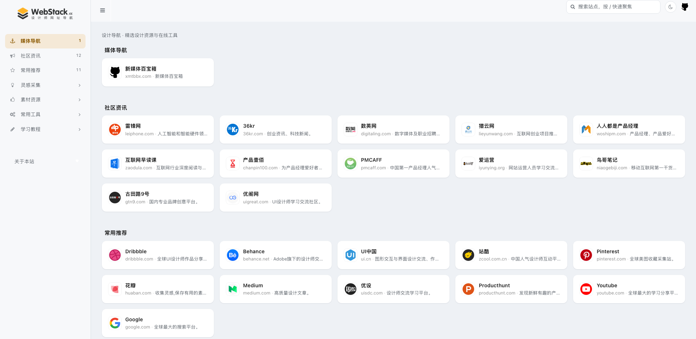
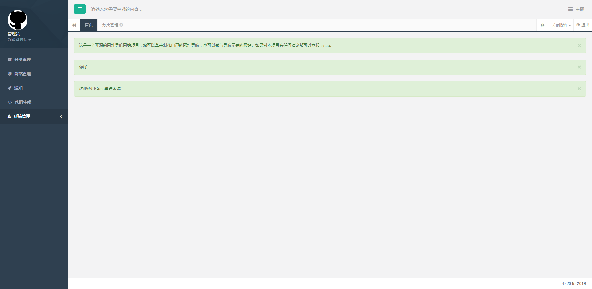
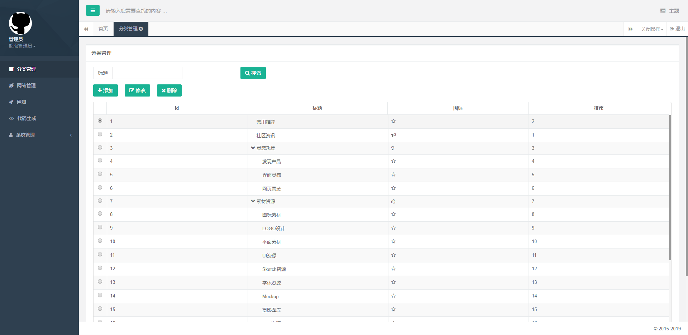
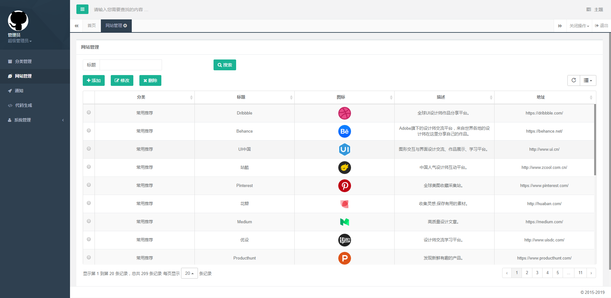

# WebStack-Guns

一个开源的网址导航网站项目，具备完整的前后台，您可以拿来制作自己的网址导航。




## 运行

运行环境：

- JDK 8（本项目会持续用 JDK 8 编译和运行）
- Maven 3.9+
- MySQL 8.x

先确认实际使用的是 JDK 8：

```shell
java -version
mvn -version
```

构建已配置 Maven Enforcer，使用 JDK 9 或更高版本会直接失败，避免误把高版本 API 编译进项目。

在本机 MySQL 中创建数据库并导入初始化数据：

```shell
mysql -h127.0.0.1 -P3306 -u你的账号 -p \
  -e "CREATE DATABASE IF NOT EXISTS guns CHARACTER SET utf8mb4 COLLATE utf8mb4_unicode_ci"
mysql -h127.0.0.1 -P3306 -u你的账号 -p guns < sql/guns.sql
```

如果是从旧版数据库升级，只需执行一次：

```shell
mysql -h127.0.0.1 -P3306 -u你的账号 -p guns < sql/security-upgrade.sql
```

数据库密码不再写死在 `application.yml`，通过环境变量传入：

```shell
export DB_URL='jdbc:mysql://127.0.0.1:3306/guns?autoReconnect=true&useUnicode=true&characterEncoding=utf8&zeroDateTimeBehavior=CONVERT_TO_NULL&useSSL=false&serverTimezone=Asia/Shanghai'
export DB_USERNAME='你的账号'
read -s DB_PASSWORD
export DB_PASSWORD

mvn clean verify
java -jar target/Webstack-Guns-1.0.jar
```

启动完成后访问：<http://127.0.0.1:8000>

本地未配置以下密钥时，应用会在每次启动时生成临时随机密钥；正式部署应显式配置，否则重启后旧 JWT 和 rememberMe Cookie 会失效：

```shell
export GUNS_JWT_SECRET="$(openssl rand -base64 64)"
export GUNS_REMEMBER_ME_CIPHER_KEY="$(openssl rand -base64 16)"
```

其他可选配置：

- `SERVER_ADDRESS`：默认 `127.0.0.1`；需要对外监听时显式设为 `0.0.0.0`
- `SERVER_PORT`：默认 `8000`
- `GUNS_FILE_UPLOAD_PATH`：默认使用系统临时目录下的独立上传目录
- `GUNS_SECURE_COOKIE`：HTTPS 部署必须设为 `true`
- `GUNS_SWAGGER_OPEN`、`GUNS_DRUID_MONITOR_OPEN`：默认关闭


## 使用

后台地址：http://domain/admin

默认用户：admin

默认密码：111111

在线demo: http://139.196.175.187:8000








## 感谢

前端设计：[**WebStackPage**](https://github.com/WebStackPage/WebStackPage.github.io)

后台框架：[**Guns**](https://github.com/stylefeng/Guns)

&nbsp;&nbsp;&nbsp;&nbsp;&nbsp;&nbsp;&nbsp;&nbsp;&nbsp;&nbsp;&nbsp;&nbsp;&nbsp;&nbsp;&nbsp;&nbsp;&nbsp;&nbsp;**SpringBoot**


## 声明

项目受 JDK 8 约束，采用 Spring Boot 2.7.x / Spring Framework 5.3.x / Shiro 1.13.x 的兼容线，并在应用层补充了登录限速、会话轮换、安全 Cookie、CSRF、富文本净化、上传校验和安全响应头。外网部署仍应放在 HTTPS 反向代理之后，并在网关层增加统一限速和访问日志告警。

## License

MIT
